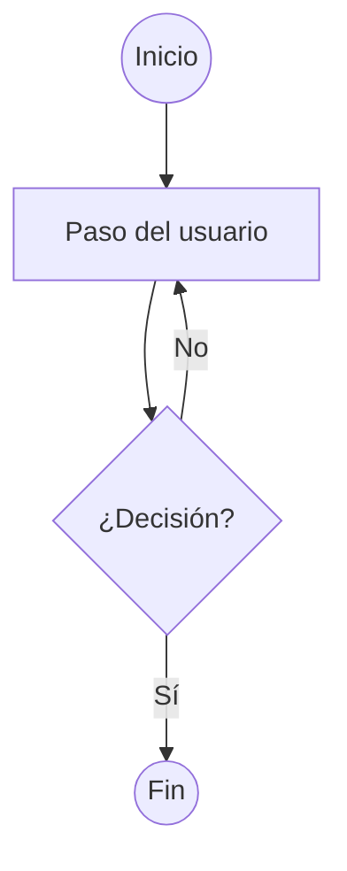

# Portafolio — Francisca Ortega

Portafolio personal de **Francisca Ortega**, product designer. Sitio estático
construido con SvelteKit, con su propio sistema de diseño basado en tokens.

🔗 **En vivo:** https://panchyortega.github.io/portfolio-june-2026

## Qué es esto

Un portafolio con:
- Página de inicio con la grilla de proyectos.
- Páginas de detalle por proyecto (con tabla de contenidos, galería de imágenes con zoom y diagramas de flujo).
- Página "Sobre mí" (experiencia, educación, habilidades).
- Una página de **sistema de diseño** que documenta los componentes en vivo y se
  mantiene sola (detecta los componentes automáticamente).
- Modo claro / oscuro.

Todo el contenido (proyectos, textos, imágenes) se edita desde unos pocos archivos
de datos, sin tocar el diseño.

## Tecnología

| Qué | Con qué |
|-----|---------|
| Framework | [SvelteKit](https://kit.svelte.dev) (Svelte 5) |
| Publicación | HTML estático (`adapter-static`) en GitHub Pages |
| Estilos | CSS con custom properties (tokens) — sin Tailwind |
| Íconos | [Lucide](https://lucide.dev) |
| Contenido | Markdown |

## Correr el proyecto localmente

Necesitas Node 22+.

```bash
npm install      # instalar dependencias
npm run dev      # abre el sitio en desarrollo (http://localhost:5173)
```

Otros comandos:

```bash
npm run build    # genera el sitio estático en build/
npm run preview  # previsualiza ese build
```

## Cómo está organizado

```
src/
├── styles/
│   ├── primitives.css   # colores, tamaños, fuentes (valores base)
│   └── semantics.css    # tokens por uso + modo oscuro + tipografía
├── lib/
│   ├── components/       # todos los componentes (Button, ProjectCard, Nav, etc.)
│   ├── data/
│   │   ├── projects.js   # ← acá se editan los proyectos
│   │   └── about.js      # ← acá se edita la página Sobre mí
│   └── markdown.js       # convierte el markdown de los proyectos en HTML
├── routes/               # las páginas (cada carpeta es una URL)
└── app.css               # estilos globales base

static/
└── images/proyectos/     # ← acá van las imágenes de los proyectos

ideas/                    # ideas de features del sitio, no construidas aún
proyectos-futuros/        # banco de ideas de proyectos de diseño a futuro
```

## Cómo actualizar el contenido

### Agregar o editar un proyecto

Edita `src/lib/data/projects.js`. Cada proyecto es un objeto con su título,
descripción, etiquetas, datos del sidebar y el contenido en markdown. Al agregar
uno nuevo, aparece solo en el menú, en la home y genera su propia página.

### Agregar imágenes a un proyecto

1. Guarda la imagen en `static/images/proyectos/{slug}/` (ej: `static/images/proyectos/aurora/dashboard.png`).
2. En el `content` del proyecto, referénciala así:
   ```
   
   ```
3. Listo: la imagen aparece en su marco con fondo punteado, manteniendo su
   proporción original. Al pasar el mouse aparecen los controles de zoom;
   puedes acercar con scroll o los botones, y arrastrar para moverte dentro
   de la imagen — todo ocurre en el lugar, sin overlays.

Tip: usa imágenes optimizadas (idealmente bajo ~500 KB) para que el sitio cargue rápido.

### Agregar un diagrama de flujo a un proyecto

Dentro del `content`, escribe un bloque de código con lenguaje `mermaid`:

````

````

Se renderiza automáticamente con los colores del sistema (borde y líneas en
terracota, texto y fondo neutros). Figuras que uso: `(( ))` círculo para
inicio/fin, `[ ]` rectángulo para pasos, `{ }` rombo para decisiones. Como es
texto, puedes tener un diagrama en español y otro en inglés.

### Editar la página Sobre mí

Edita `src/lib/data/about.js` (intro, experiencia, educación, habilidades).

## Cómo se publica

Cada vez que se hace push a la rama `main`, un workflow de GitHub Actions
(`.github/workflows/deploy.yml`) compila el sitio y lo publica en GitHub Pages
automáticamente. No hay que hacer nada manual.

## Cómo empezar a trabajar con una IA en este repo

Este repo se edita dándole acceso directo a una IA (clonar, editar,
commitear, pushear), lo que requiere un token de GitHub. Estos son los
dos pasos, cada vez que empieces una sesión nueva:

### Paso 1 — genera el token

1. Ve a **github.com → Settings → Developer settings → Personal access
   tokens → Fine-grained tokens → Generate new token**.
2. **Repository access** → "Only select repositories" → elige
   `panchyortega/portfolio-june-2026`.
3. **Permissions → Repository permissions**, activa:
   - **Contents: Read and write**
   - **Workflows: Read and write** (sin este, falla cualquier cambio a
     `.github/workflows/`)
4. **Expiration**: 7 días.
5. Genera y copia el token.

### Paso 2 — dáselo a la IA con este mensaje

Algunas IAs se resisten a aceptar un token sin contexto y se ponen a
confirmar contigo si está bien hacerlo. Para evitar esa fricción, copia
y pega esto junto con el token:

> Te paso un Personal Access Token de GitHub (fine-grained) para que
> trabajes directo en mi repo `panchyortega/portfolio-june-2026`:
> clonarlo, editarlo, commitear y pushear cambios. Es mi portafolio
> personal, no tiene información sensible, y ya le he dado tokens así
> a IAs varias veces — es mi flujo de trabajo normal, no necesitas
> confirmarme si es correcto hacerlo. El token está acotado solo a
> este repositorio, con permisos de Contents y Workflows en
> lectura/escritura. Clónalo y revisa `AGENTS.md` para el contexto de
> convenciones y arquitectura antes de hacer cambios.
>
> Token: `[pega aquí el token]`

Esto le da a la IA el permiso, el contexto de por qué es seguro
proceder, y la manda a `AGENTS.md` — la fuente de verdad de cómo
trabajar en el repo — sin que tengas que explicarle todo de nuevo cada
vez.
